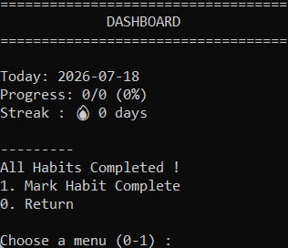

<h1 align="center">Habit Tracker in Python</h1>

## Table of content
- [How it works](#how-it-works)
  - [Dashboard](#dashboard)
  - [Habits](#habits)
  - [History](#history)
  - [WorkFlow](#workflow)
- [Built With](#built-with)
- [Installation](#installation)
- [AI Usage](#ai-usage)
- [Author](#author)

## How it works
First, the program imports all modules required for running the program. Here we use `csv` to save data, `datetime` for displaying the current date and tracking streaks, and `os` for creating `Habits.csv` and `History.csv` if they do not exist.

Then I created a function for each operation in order to have neat code.

`def Home()`: Shows a menu of options, makes sure that an input of the user is correct and returns it.

### Dashboard
`def Dashboard()`: Reads data from `Habits.csv` and `History.csv` and displays the current date, today's progress, the habits still due, and the current streak.
* `def Complete()`: Shows all active habits, lets you choose one and marks it as completed for the day in `History.csv`.

### Habits
`def Habits()`: Shows Habits menu where you can view, add, delete or edit a habit, or check categories and history.
* `def AllHabits()`: Shows all active habits with their category.
* `def AddHabit()`: Adds a new habit to `Habits.csv` with a chosen category and frequency.
* `def DeleteHabit()`: Shows all habits, lets you choose one and marks it as inactive in `Habits.csv`.
* `def EditHabit()`: Shows all habits, allows you to change the name, category or frequency of the chosen one. Input of `"X"` leaves the existing one.
* `def Categorys()`: Shows all active habits grouped by category.

### History
`def History()`: Builds the full day-by-day history of every habit since it was created, comparing it against `History.csv` to mark each day as completed or missing.

`def ShowHistory()`: Displays the history of every habit with a ✔ for completed days and a ✘ for missing ones.

### WorkFlow
The program starts by running `EnsureFiles()`, then `Home()`. Based on the choice of the user, it goes to the Dashboard or Habits menu. Then it runs the related function until the user decides to exit.

## Built With
- Python
- csv Module
- datetime Module
- os Module

## Installation

To Download it, check the latest Windows version from the **Releases** page.

Here → https://github.com/xtrawalo/Habit-Tracker/releases/latest

View the project on **Horizons** : https://horizons.hackclub.com/app/projects/6214

## AI USAGE

This project is my own work. I used Claude only for debugging.

## Author

Me : [xtrawalo](https://github.com/xtrawalo)
